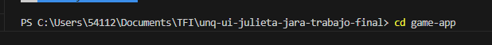
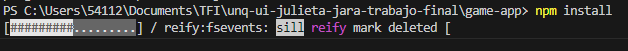
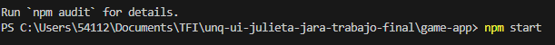
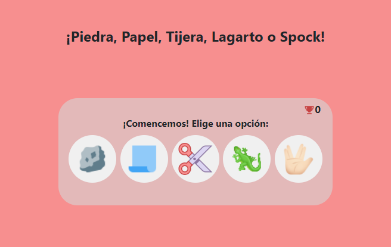

# Trabajo Final Integrador (TFI) 

- En principio, dirigirse a la carpeta game-app.

  

- Luego, ejecutar el comando npm install en la terminal.

  

- A continuación, ejecutar el comando npm start.

  

- Finalmente, se abrirá en el navegador ¡Piedra, Papel, Tijera, Lagarto o Spock!

  

